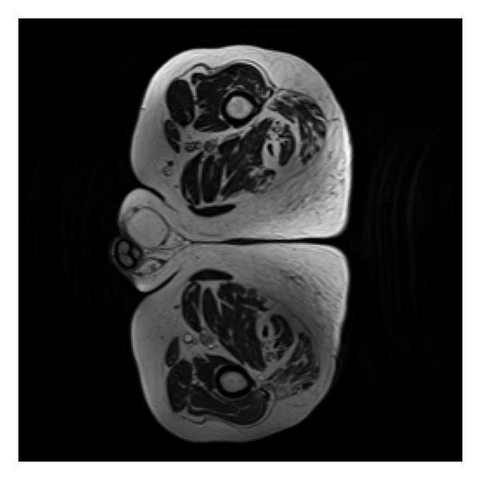
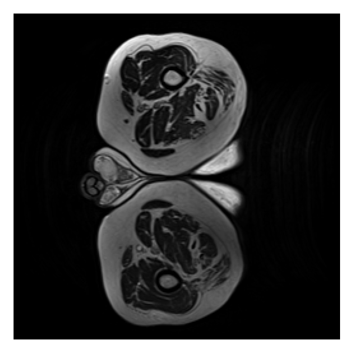
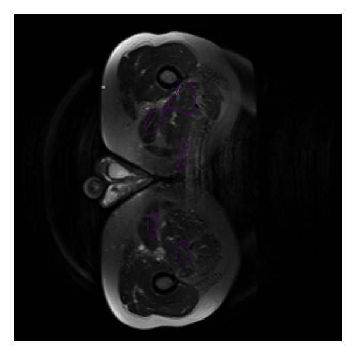

Difficulty: **Easy** | Student ID: **48798112**

# UNet – HipMRI 2D Prostate Segmentation (Easy)

## Task
2D segmentation of the **prostate** (label id = **5**) from HipMRI axial slices.  
All code is under `recognition/unet_hipmri2d_48798112/` (key files: `dataset.py`, `modules.py`, `train.py`, `predict.py`).

> **Setup note (Rangpur → Local):**  
> I first tried to run on UQ **Rangpur** following the course guide, but long queue times and interactive GPU issues blocked progress. I switched to a **local GPU (WSL2 + RTX 2060, 6GB)** and completed training/evaluation there. Both paths are documented below.

---

## Data

The dataset has two folders:
- **Images:** `semantic_MRs/`  (e.g., `Case_004_Week0_LFOV.nii.gz`)
- **Labels:** `semantic_labels_only/` (e.g., `Case_004_Week0_SEMANTIC_LFOV.nii.gz`)

**Pairing rule:** `Case_*_WeekK_LFOV.nii.gz` ↔ `Case_*_WeekK_SEMANTIC_LFOV.nii.gz`  
**Split:** handled in `dataset.py` (≈70/15/15 by **volume**).

### Local path used for this submission
- **Root:** `/home/junqin/COMP3710`  
  (contains `semantic_MRs/` and `semantic_labels_only/`)

> (If starting from Windows) Data was originally at  
> `C:\Users\0.0\Desktop\UQ Study2\COMP3710\report\{semantic_MRs, semantic_labels_only}`  
> and then copied/mounted into WSL at `/home/junqin/COMP3710`.

### Cluster (Rangpur, optional)
- Root: `/home/groups/comp3710/HipMRI_Study_open`  
- Images: `semantic_MRs/`  
- Labels: `semantic_labels_only/`

---

## Environment

### Local (used for final runs)
- **Platform:** WSL2 (Ubuntu 22.04), NVIDIA **RTX 2060 (6GB)**  
- **Driver/CUDA:** Driver 545 / CUDA 12.x  
- **Conda env:** `comp3710`  
- **Key packages:** Python 3.9, PyTorch **2.5.1+cu121**, `nibabel`, `matplotlib`

### Rangpur (initial attempt)
- **Conda env:** `comp3710` (course-provided)
- Python 3.10 + PyTorch (pre-installed)

---

## How to Run (Repro)

> Replace `--data` with your data root if different.

### Training
**Warm start (recommended)** — continue training from latest `best.ckpt`:
```bash
python -m recognition.unet_hipmri2d_48798112.train \
  --data /home/junqin/COMP3710 \
  --epochs 40 --batch 8 --lr 1e-3 --size 256 \
  --out runs/unet256_bs8_sched --prostate-id 5 \
  --max-train-steps 600 --max-val-steps 200 --log-every 50 \
  --init runs/unet256_bs8_sched/best.ckpt

From scratch:

python -m recognition.unet_hipmri2d_48798112.train \
  --data /home/junqin/COMP3710 \
  --epochs 40 --batch 8 --lr 1e-3 --size 256 \
  --out runs/unet256_bs8_sched --prostate-id 5 \
  --max-train-steps 600 --max-val-steps 200 --log-every 50


Model/Loss: UNet(1→1), input 256×256; loss = 0.7 * BCE(pos_weight) + 0.3 * Dice
Scheduler: ReduceLROnPlateau (mode=max, monitor val Dice)

Evaluation / Prediction

Validation (trend check):

python -m recognition.unet_hipmri2d_48798112.predict \
  --data /home/junqin/COMP3710 \
  --weights runs/unet256_bs8_sched/best.ckpt \
  --split val --size 256 --batch 4 --prostate-id 5 \
  --threshold 0.5 --save-overlay --save-n 24 \
  --out runs/unet256_bs8_sched/preds_val


Test (report metric):

python -m recognition.unet_hipmri2d_48798112.predict \
  --data /home/junqin/COMP3710 \
  --weights runs/unet256_bs8_sched/best.ckpt \
  --split test --size 256 --batch 4 --prostate-id 5 \
  --threshold 0.5 --save-overlay --save-n 24 \
  --out runs/unet256_bs8_sched/preds_test


Metric note: The printed Val/Test mean Dice is computed on continuous outputs (no threshold).
--threshold 0.5 only affects overlay visualization (dashed = prediction, solid = GT).

Results

Model: 2D UNet (1→1), 256×256, batch=8, loss=BCE(pos_weight)+Dice, LR=1e-3 (+ ReduceLROnPlateau)
Checkpoint: runs/unet256_bs8_sched/best.ckpt
Data: prostate_id=5, splits from dataset.py.

Val mean Dice = 0.1308

Test mean Dice = 0.1376 ← report metric

## Results

**Model**: 2D UNet (1→1), 256×256, batch=8, loss = BCE(pos_weight) + Dice, lr = 1e-3 (+ ReduceLROnPlateau)  
**Checkpoint**: `runs/unet256_bs8_sched/best.ckpt`

- **Val mean Dice = _0.1308_**  
- **Test mean Dice = _0.1376_**  ← report metric

### Qualitative examples (Test)
**Good**  


**Medium**  


**Hard**  

